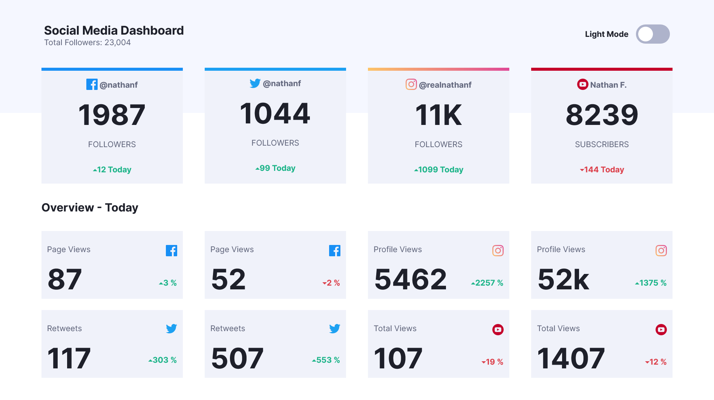
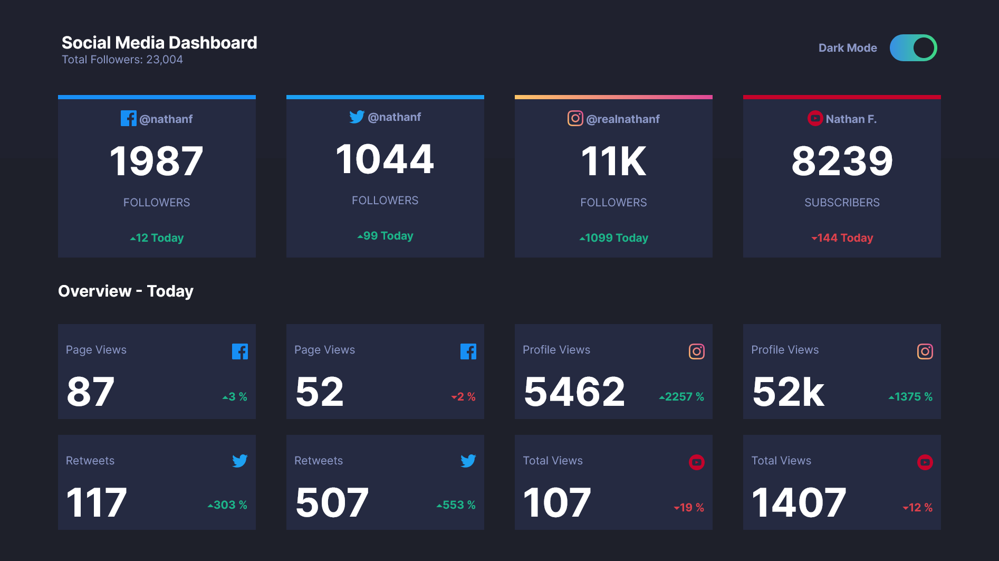
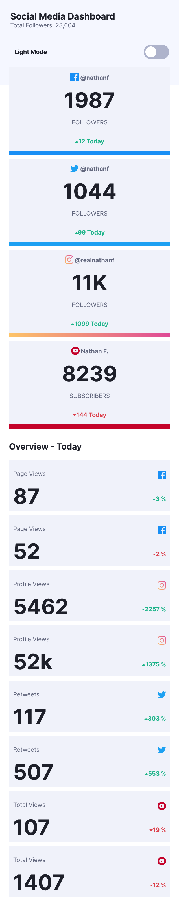
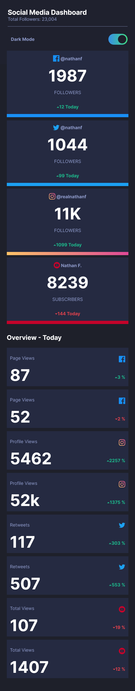

# Frontend Mentor - Social media dashboard with theme switcher

## The challenge

Your challenge is to build out this Social Media Dashboard and get it looking as close to the design as possible.

You can use any tools you like to help you complete the challenge. So if you've got something you'd like to practice, feel free to give it a go.

Your users should be able to:

- View the optimal layout for the site depending on their device's screen size
- See hover states for all interactive elements on the page
- Toggle color theme to their preference

I added the following:

- The theme is saved with localhost so when the page is refreshed the theme is still there.
- I used a data.js file to import all the data instead of hardcoding it in the html.

## Screenshots

